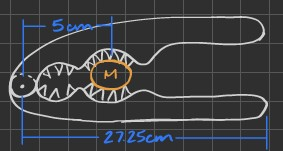

## 1. Problem Statement and Objective
Find a feasible design for a manual lever nutcracker capable of cracking a macadamia nut.

## 2. Constraints and Input Parameters
* **Required Force:** 2180 N (490 lbs)
* **Avg. Grip Strength:** 400 N (90 lbs)
* **Nut Size:** 20 mm - 30 mm

## 3. Approach and Calculations
Using a Class 2 lever, the mechanical advantage (MA) required is:
$$MA = \frac{2180\text{ N}}{400\text{ N}} = 5.45$$

To achieve this, the handle length ($L_H$) must be 5.45 times the distance from the pivot to the nut ($d_p$). Assuming $d_p = 5\text{ cm}$:
$$L_H = 5.45 \times 5\text{ cm} = 27.25\text{ cm}$$

## 4. Design Diagram

## 5. Usability Discussion
While a 27.25 cm (approx. 10.7 in) tool is standard for heavy-duty kitchenware, it is quite large for a typical single-handed nutcracker. Furthermore, requiring 400 N of force is at the absolute limit for most people, making it unusable for children, the elderly, or individuals with grip weaknesses. To improve usability, a Heavy Duty Linear Actuator was selected. This actuator can output up to 2000 lbs--four times the required force--at a stroke of only 2 inches. This makes the tool both physically powerful enough for any user and compact enough for kitchen storage.

